# System Architecture Analysis
<!-- generated in 0.00s -->

## Overview

- **Project**: /home/tom/github/semcod/nexu
- **Primary Language**: python
- **Languages**: python: 35, yaml: 3, shell: 2, toml: 1
- **Analysis Mode**: static
- **Total Functions**: 116
- **Total Classes**: 13
- **Modules**: 42
- **Entry Points**: 35

## Architecture by Module

### src.nexu.cli
- **Functions**: 21
- **File**: `cli.py`

### src.nexu.mcp_server
- **Functions**: 10
- **File**: `mcp_server.py`

### src.nexu.models
- **Functions**: 10
- **Classes**: 9
- **File**: `models.py`

### src.nexu.paths
- **Functions**: 6
- **File**: `paths.py`

### src.nexu.orchestrate
- **Functions**: 6
- **File**: `orchestrate.py`

### src.nexu.intract
- **Functions**: 6
- **Classes**: 1
- **File**: `intract.py`

### src.nexu.llm
- **Functions**: 5
- **File**: `llm.py`

### src.nexu.capsule
- **Functions**: 5
- **File**: `capsule.py`

### src.nexu.verify
- **Functions**: 5
- **File**: `verify.py`

### src.nexu.files
- **Functions**: 4
- **File**: `files.py`

### src.nexu.runtime
- **Functions**: 4
- **File**: `runtime.py`

### src.nexu.journal
- **Functions**: 3
- **File**: `journal.py`

### src.nexu.report
- **Functions**: 3
- **File**: `report.py`

### src.nexu.plan
- **Functions**: 2
- **File**: `plan.py`

### src.nexu.review
- **Functions**: 2
- **File**: `review.py`

### src.nexu.hashing
- **Functions**: 2
- **File**: `hashing.py`

### src.nexu.export_prompt
- **Functions**: 2
- **File**: `export_prompt.py`

### src.nexu.promote
- **Functions**: 2
- **File**: `promote.py`

### src.nexu.bundle
- **Functions**: 2
- **File**: `bundle.py`

### src.nexu.config
- **Functions**: 2
- **Classes**: 3
- **File**: `config.py`

## Key Entry Points

Main execution flows into the system:

### src.nexu.cli.capsule_diff
> Compare capsule src files against the frozen baseline lock.
- **Calls**: capsule_app.command, src.nexu.paths.project_root, src.nexu.diff.diff_capsule, Table, table.add_row, table.add_row, table.add_row, table.add_row

### src.nexu.cli.capsule_status_command
> Show capsule status, latest iteration, diff counters and verification summary.
- **Calls**: capsule_app.command, src.nexu.paths.project_root, src.nexu.status.capsule_status, console.print, console.print, console.print, Table, files.items

### src.nexu.cli.capsule_journal
> Show capsule event journal.
- **Calls**: capsule_app.command, src.nexu.paths.project_root, Table, console.print, src.nexu.journal.read_journal, table.add_row, str, str

### src.nexu.cli.capsule_orchestrate
> Build an offline or LLM-assisted orchestration plan for capsule evolution.
- **Calls**: capsule_app.command, src.nexu.paths.project_root, src.nexu.orchestrate.build_capsule_orchestration, console.print, console.print, console.print, typer.Argument, typer.Option

### src.nexu.models.Capsule.from_dict
- **Calls**: CapsuleSelection, CapsuleRuntime, cls, data.get, data.get, data.get, data.get, data.get

### src.nexu.cli.capsule_create
> Create an isolated capsule from selected project files.
- **Calls**: capsule_app.command, src.nexu.paths.project_root, src.nexu.capsule.create_capsule, src.nexu.blueprint.build_blueprint, console.print, console.print, console.print, typer.Argument

### src.nexu.cli.capsule_review
> Build an evidence-based review packet for human or optional LLM review.
- **Calls**: capsule_app.command, src.nexu.paths.project_root, src.nexu.review.build_review_packet, console.print, console.print, console.print, typer.Argument, typer.Option

### src.nexu.cli.capsule_plan
> Create a deterministic S1..Sn capsule iteration plan.
- **Calls**: capsule_app.command, src.nexu.paths.project_root, src.nexu.plan.build_iteration_plan, console.print, console.print, console.print, Syntax, typer.Argument

### src.nexu.cli.capsule_report
> Build Markdown/HTML/YAML report with verification evidence.
- **Calls**: capsule_app.command, src.nexu.paths.project_root, src.nexu.report.build_capsule_report, console.print, console.print, console.print, typer.Argument, typer.Option

### src.nexu.cli.capsule_iterate
> Create planned S1..Sn iteration folders and prompts.
- **Calls**: capsule_app.command, src.nexu.paths.project_root, src.nexu.iterate.iterate_capsule, src.nexu.journal.append_journal, console.print, typer.Argument, typer.Option, typer.Option

### src.nexu.cli.capsule_runtime
> Build a static HTML runtime/mock for the isolated capsule.
- **Calls**: capsule_app.command, src.nexu.paths.project_root, src.nexu.runtime.build_capsule_runtime, console.print, console.print, typer.Argument, typer.Option, None.relative_to

### src.nexu.cli.freeze
> Freeze a lightweight hash snapshot of the current project.
- **Calls**: app.command, src.nexu.paths.project_root, src.nexu.freeze.freeze_project, console.print, console.print, console.print, typer.Argument, typer.Option

### src.nexu.cli.capsule_blueprint
> Generate a UI/API/test blueprint from capsule selection and Intract contracts.
- **Calls**: capsule_app.command, src.nexu.paths.project_root, src.nexu.blueprint.build_blueprint, console.print, console.print, Syntax, typer.Argument, typer.Option

### src.nexu.cli.capsule_drift
> Check whether the original source files changed since capsule creation.
- **Calls**: capsule_app.command, src.nexu.paths.project_root, src.nexu.drift.check_source_drift, console.print, console.print, console.print, typer.Argument, typer.Option

### src.nexu.cli.capsule_verify
> Verify a capsule against basic intent-contract gates.
- **Calls**: capsule_app.command, src.nexu.paths.project_root, src.nexu.verify.verify_capsule, console.print, console.print, Table, console.print, table.add_row

### src.nexu.cli.capsule_bundle
> Build a portable ZIP bundle with capsule context, evidence and prompts.
- **Calls**: capsule_app.command, src.nexu.paths.project_root, src.nexu.bundle.build_capsule_bundle, console.print, console.print, typer.Argument, typer.Option, typer.Option

### src.nexu.cli.capsule_promote
> Build a promotion plan for copying capsule changes back to the source project.
- **Calls**: capsule_app.command, src.nexu.paths.project_root, src.nexu.promote.build_promotion_plan, console.print, console.print, console.print, typer.Argument, typer.Option

### src.nexu.cli.capsule_export_prompt
> Export an LLM-ready prompt constrained by capsule contracts and blueprint.
- **Calls**: capsule_app.command, src.nexu.paths.project_root, src.nexu.export_prompt.export_iteration_prompt, console.print, typer.Argument, typer.Option, typer.Option, None.relative_to

### src.nexu.cli.capsule_list
> List local capsules.
- **Calls**: capsule_app.command, src.nexu.paths.project_root, src.nexu.capsule.list_capsules, Table, console.print, console.print, table.add_row, typer.Argument

### src.nexu.cli.init
> Initialize nexu files in a project.
- **Calls**: app.command, src.nexu.paths.project_root, src.nexu.init_project.init_project, console.print, console.print, typer.Argument, item.relative_to

### src.nexu.cli.mcp_tools
> List nexu MCP tools exposed by the stdio service.
- **Calls**: mcp_app.command, Table, console.print, table.add_row, str, str, tool.get

### src.nexu.cli.mcp_serve
> Run a conservative MCP-compatible JSON-RPC stdio service for nexu tools.
- **Calls**: mcp_app.command, src.nexu.paths.project_root, src.nexu.mcp_server.run_mcp_stdio, typer.BadParameter, typer.Option, typer.Option

### src.nexu.models.FrozenSnapshot.from_dict
- **Calls**: cls, FrozenFile, data.get, data.get, data.get, src.nexu.models.utc_now

### examples.frontend_view.src.menu_icons.preview_menu_icons
- **Calls**: item.get, mapping.get, changes.append

### src.nexu.hashing.sha256_text
- **Calls**: None.hexdigest, hashlib.sha256, text.encode

### examples.backend_service.app.users.list_users
- **Calls**: filters.get, user.get

### src.nexu.models.FrozenSnapshot.to_dict
- **Calls**: asdict

### src.nexu.models.Capsule.to_dict
- **Calls**: asdict

### src.nexu.models.VerificationReport.to_dict
- **Calls**: asdict

### src.nexu.models.CapsuleDiff.to_dict
- **Calls**: asdict

## Process Flows

Key execution flows identified:

### Flow 1: capsule_diff
```
capsule_diff [src.nexu.cli]
  └─ →> project_root
  └─ →> diff_capsule
      └─ →> load_capsule
          └─ →> read_yaml
          └─ →> capsule_dir
```

### Flow 2: capsule_status_command
```
capsule_status_command [src.nexu.cli]
  └─ →> project_root
  └─ →> capsule_status
      └─ →> load_capsule
          └─ →> read_yaml
          └─ →> capsule_dir
```

### Flow 3: capsule_journal
```
capsule_journal [src.nexu.cli]
  └─ →> project_root
  └─ →> read_journal
      └─> journal_path
          └─ →> capsule_dir
      └─ →> read_yaml
```

### Flow 4: capsule_orchestrate
```
capsule_orchestrate [src.nexu.cli]
  └─ →> project_root
  └─ →> build_capsule_orchestration
      └─> build_orchestration_context
          └─ →> load_capsule
          └─ →> capsule_dir
```

### Flow 5: from_dict
```
from_dict [src.nexu.models.Capsule]
```

### Flow 6: capsule_create
```
capsule_create [src.nexu.cli]
  └─ →> project_root
  └─ →> create_capsule
      └─ →> ensure_project_dirs
          └─> nexu_dir
          └─> snapshots_dir
  └─ →> build_blueprint
      └─ →> load_capsule
          └─ →> read_yaml
          └─ →> capsule_dir
```

### Flow 7: capsule_review
```
capsule_review [src.nexu.cli]
  └─ →> project_root
  └─ →> build_review_packet
      └─ →> load_config
          └─ →> read_yaml
      └─ →> capsule_dir
```

### Flow 8: capsule_plan
```
capsule_plan [src.nexu.cli]
  └─ →> project_root
  └─ →> build_iteration_plan
      └─> _contract_summary
      └─ →> load_capsule
          └─ →> read_yaml
```

### Flow 9: capsule_report
```
capsule_report [src.nexu.cli]
  └─ →> project_root
  └─ →> build_capsule_report
      └─ →> capsule_dir
          └─> capsules_dir
      └─ →> verify_capsule
```

### Flow 10: capsule_iterate
```
capsule_iterate [src.nexu.cli]
  └─ →> project_root
  └─ →> iterate_capsule
      └─ →> load_capsule
          └─ →> read_yaml
          └─ →> capsule_dir
  └─ →> append_journal
      └─> read_journal
          └─> journal_path
          └─ →> read_yaml
```

## Key Classes

### src.nexu.models.FrozenSnapshot
- **Methods**: 2
- **Key Methods**: src.nexu.models.FrozenSnapshot.to_dict, src.nexu.models.FrozenSnapshot.from_dict

### src.nexu.models.Capsule
- **Methods**: 2
- **Key Methods**: src.nexu.models.Capsule.to_dict, src.nexu.models.Capsule.from_dict

### src.nexu.intract.IntentContract
- **Methods**: 1
- **Key Methods**: src.nexu.intract.IntentContract.key

### src.nexu.models.VerificationReport
- **Methods**: 1
- **Key Methods**: src.nexu.models.VerificationReport.to_dict

### src.nexu.models.CapsuleDiff
- **Methods**: 1
- **Key Methods**: src.nexu.models.CapsuleDiff.to_dict

### src.nexu.models.PromptExport
- **Methods**: 1
- **Key Methods**: src.nexu.models.PromptExport.to_dict

### src.nexu.config.LLMConfig
- **Methods**: 0

### src.nexu.config.ReviewConfig
- **Methods**: 0

### src.nexu.config.nexuConfig
- **Methods**: 0

### src.nexu.models.FrozenFile
- **Methods**: 0

### src.nexu.models.CapsuleSelection
- **Methods**: 0

### src.nexu.models.CapsuleRuntime
- **Methods**: 0

### src.nexu.models.VerificationFinding
- **Methods**: 0

## Data Transformation Functions

Key functions that process and transform data:

### src.nexu.intract.parse_intract_line
- **Output to**: src.nexu.intract._tokenize_contract, line.strip, IntentContract, fields.get, fields.get

## Public API Surface

Functions exposed as public API (no underscore prefix):

- `src.nexu.verify.verify_capsule` - 59 calls
- `src.nexu.config.load_config` - 41 calls
- `src.nexu.report.build_capsule_report` - 32 calls
- `src.nexu.intract.read_manifest_contracts` - 32 calls
- `src.nexu.orchestrate.build_capsule_orchestration` - 28 calls
- `examples.run_examples.run_example` - 26 calls
- `src.nexu.review.build_review_packet` - 24 calls
- `src.nexu.capsule.create_capsule` - 24 calls
- `src.nexu.orchestrate.offline_orchestration_from_context` - 22 calls
- `src.nexu.intract.parse_intract_line` - 22 calls
- `src.nexu.mcp_server.handle_mcp_message` - 19 calls
- `src.nexu.cli.capsule_diff` - 19 calls
- `src.nexu.export_prompt.export_iteration_prompt` - 17 calls
- `src.nexu.cli.capsule_status_command` - 17 calls
- `src.nexu.cli.capsule_journal` - 17 calls
- `src.nexu.runtime.build_capsule_runtime` - 16 calls
- `src.nexu.promote.build_promotion_plan` - 16 calls
- `src.nexu.cli.capsule_orchestrate` - 16 calls
- `src.nexu.models.Capsule.from_dict` - 16 calls
- `src.nexu.plan.build_iteration_plan` - 15 calls
- `src.nexu.cli.capsule_create` - 15 calls
- `src.nexu.cli.capsule_review` - 15 calls
- `src.nexu.bundle.build_capsule_bundle` - 15 calls
- `src.nexu.diff.diff_capsule` - 14 calls
- `src.nexu.iterate.iterate_capsule` - 14 calls
- `src.nexu.cli.capsule_plan` - 14 calls
- `src.nexu.llm.call_litellm_json` - 13 calls
- `src.nexu.cli.capsule_report` - 12 calls
- `src.nexu.freeze.freeze_project` - 12 calls
- `src.nexu.orchestrate.build_orchestration_context` - 11 calls
- `src.nexu.cli.capsule_iterate` - 11 calls
- `src.nexu.cli.capsule_runtime` - 11 calls
- `src.nexu.status.capsule_status` - 10 calls
- `src.nexu.drift.check_source_drift` - 10 calls
- `src.nexu.cli.freeze` - 10 calls
- `src.nexu.cli.capsule_blueprint` - 10 calls
- `src.nexu.cli.capsule_drift` - 10 calls
- `src.nexu.cli.capsule_verify` - 10 calls
- `src.nexu.cli.capsule_bundle` - 10 calls
- `src.nexu.cli.capsule_promote` - 10 calls

## System Interactions

How components interact:

```mermaid
graph TD
    capsule_diff --> command
    capsule_diff --> project_root
    capsule_diff --> diff_capsule
    capsule_diff --> Table
    capsule_diff --> add_row
    capsule_status_comma --> command
    capsule_status_comma --> project_root
    capsule_status_comma --> capsule_status
    capsule_status_comma --> print
    capsule_journal --> command
    capsule_journal --> project_root
    capsule_journal --> Table
    capsule_journal --> print
    capsule_journal --> read_journal
    capsule_orchestrate --> command
    capsule_orchestrate --> project_root
    capsule_orchestrate --> build_capsule_orches
    capsule_orchestrate --> print
    from_dict --> CapsuleSelection
    from_dict --> CapsuleRuntime
    from_dict --> cls
    from_dict --> get
    capsule_create --> command
    capsule_create --> project_root
    capsule_create --> create_capsule
    capsule_create --> build_blueprint
    capsule_create --> print
    capsule_review --> command
    capsule_review --> project_root
    capsule_review --> build_review_packet
```



## Reverse Engineering Guidelines

1. **Entry Points**: Start analysis from the entry points listed above
2. **Core Logic**: Focus on classes with many methods
3. **Data Flow**: Follow data transformation functions
4. **Process Flows**: Use the flow diagrams for execution paths
5. **API Surface**: Public API functions reveal the interface

## Context for LLM

Maintain the identified architectural patterns and public API surface when suggesting changes.