# System Architecture Analysis
<!-- generated in 0.00s -->

## Overview

- **Project**: /home/tom/github/semcod/nexu
- **Primary Language**: python
- **Languages**: python: 24, yaml: 2, shell: 2, toml: 1
- **Analysis Mode**: static
- **Total Functions**: 66
- **Total Classes**: 10
- **Modules**: 30
- **Entry Points**: 24

## Architecture by Module

### src.vico.cli
- **Functions**: 12
- **File**: `cli.py`

### src.vico.models
- **Functions**: 10
- **Classes**: 9
- **File**: `models.py`

### src.vico.intract
- **Functions**: 6
- **Classes**: 1
- **File**: `intract.py`

### src.vico.paths
- **Functions**: 6
- **File**: `paths.py`

### src.vico.verify
- **Functions**: 5
- **File**: `verify.py`

### src.vico.capsule
- **Functions**: 5
- **File**: `capsule.py`

### src.vico.files
- **Functions**: 4
- **File**: `files.py`

### examples.run_examples
- **Functions**: 2
- **File**: `run_examples.py`

### src.vico.export_prompt
- **Functions**: 2
- **File**: `export_prompt.py`

### src.vico.hashing
- **Functions**: 2
- **File**: `hashing.py`

### examples.vertical_slice.src.flow
- **Functions**: 1
- **File**: `flow.py`

### examples.backend_service.app.users
- **Functions**: 1
- **File**: `users.py`

### examples.frontend_view.src.menu_icons
- **Functions**: 1
- **File**: `menu_icons.py`

### src.vico.init_project
- **Functions**: 1
- **File**: `init_project.py`

### src.vico.freeze
- **Functions**: 1
- **File**: `freeze.py`

### src.vico.blueprint
- **Functions**: 1
- **File**: `blueprint.py`

### src.vico.status
- **Functions**: 1
- **File**: `status.py`

### src.vico.iterate
- **Functions**: 1
- **File**: `iterate.py`

### src.vico.drift
- **Functions**: 1
- **File**: `drift.py`

### src.vico.git
- **Functions**: 1
- **File**: `git.py`

## Key Entry Points

Main execution flows into the system:

### src.vico.cli.capsule_diff
> Compare capsule src files against the frozen baseline lock.
- **Calls**: capsule_app.command, src.vico.paths.project_root, src.vico.diff.diff_capsule, Table, table.add_row, table.add_row, table.add_row, table.add_row

### src.vico.cli.capsule_status_command
> Show capsule status, latest iteration, diff counters and verification summary.
- **Calls**: capsule_app.command, src.vico.paths.project_root, src.vico.status.capsule_status, console.print, console.print, console.print, Table, files.items

### src.vico.models.Capsule.from_dict
- **Calls**: CapsuleSelection, CapsuleRuntime, cls, data.get, data.get, data.get, data.get, data.get

### src.vico.cli.capsule_create
> Create an isolated capsule from selected project files.
- **Calls**: capsule_app.command, src.vico.paths.project_root, src.vico.capsule.create_capsule, src.vico.blueprint.build_blueprint, console.print, console.print, console.print, typer.Argument

### src.vico.cli.freeze
> Freeze a lightweight hash snapshot of the current project.
- **Calls**: app.command, src.vico.paths.project_root, src.vico.freeze.freeze_project, console.print, console.print, console.print, typer.Argument, typer.Option

### src.vico.cli.capsule_blueprint
> Generate a UI/API/test blueprint from capsule selection and Intract contracts.
- **Calls**: capsule_app.command, src.vico.paths.project_root, src.vico.blueprint.build_blueprint, console.print, console.print, Syntax, typer.Argument, typer.Option

### src.vico.cli.capsule_drift
> Check whether the original source files changed since capsule creation.
- **Calls**: capsule_app.command, src.vico.paths.project_root, src.vico.drift.check_source_drift, console.print, console.print, console.print, typer.Argument, typer.Option

### src.vico.cli.capsule_verify
> Verify a capsule against basic intent-contract gates.
- **Calls**: capsule_app.command, src.vico.paths.project_root, src.vico.verify.verify_capsule, console.print, console.print, Table, console.print, table.add_row

### src.vico.cli.capsule_promote
> Build a promotion plan for copying capsule changes back to the source project.
- **Calls**: capsule_app.command, src.vico.paths.project_root, src.vico.promote.build_promotion_plan, console.print, console.print, console.print, typer.Argument, typer.Option

### src.vico.cli.capsule_iterate
> Create planned S1..Sn iteration folders and prompts.
- **Calls**: capsule_app.command, src.vico.paths.project_root, src.vico.iterate.iterate_capsule, console.print, typer.Argument, typer.Option, typer.Option, typer.Option

### src.vico.cli.capsule_export_prompt
> Export an LLM-ready prompt constrained by capsule contracts and blueprint.
- **Calls**: capsule_app.command, src.vico.paths.project_root, src.vico.export_prompt.export_iteration_prompt, console.print, typer.Argument, typer.Option, typer.Option, None.relative_to

### src.vico.cli.capsule_list
> List local capsules.
- **Calls**: capsule_app.command, src.vico.paths.project_root, src.vico.capsule.list_capsules, Table, console.print, console.print, table.add_row, typer.Argument

### src.vico.cli.init
> Initialize Vico files in a project.
- **Calls**: app.command, src.vico.paths.project_root, src.vico.init_project.init_project, console.print, console.print, typer.Argument, item.relative_to

### src.vico.models.FrozenSnapshot.from_dict
- **Calls**: cls, FrozenFile, data.get, data.get, data.get, src.vico.models.utc_now

### examples.frontend_view.src.menu_icons.preview_menu_icons
- **Calls**: item.get, mapping.get, changes.append

### src.vico.hashing.sha256_text
- **Calls**: None.hexdigest, hashlib.sha256, text.encode

### examples.backend_service.app.users.list_users
- **Calls**: filters.get, user.get

### examples.run_examples.main
- **Calls**: examples.run_examples.run_example

### src.vico.models.FrozenSnapshot.to_dict
- **Calls**: asdict

### src.vico.models.Capsule.to_dict
- **Calls**: asdict

### src.vico.models.VerificationReport.to_dict
- **Calls**: asdict

### src.vico.models.CapsuleDiff.to_dict
- **Calls**: asdict

### src.vico.models.PromptExport.to_dict
- **Calls**: asdict

### examples.vertical_slice.src.flow.run_flow

## Process Flows

Key execution flows identified:

### Flow 1: capsule_diff
```
capsule_diff [src.vico.cli]
  └─ →> project_root
  └─ →> diff_capsule
      └─ →> load_capsule
          └─ →> read_yaml
          └─ →> capsule_dir
```

### Flow 2: capsule_status_command
```
capsule_status_command [src.vico.cli]
  └─ →> project_root
  └─ →> capsule_status
      └─ →> load_capsule
          └─ →> read_yaml
          └─ →> capsule_dir
```

### Flow 3: from_dict
```
from_dict [src.vico.models.Capsule]
```

### Flow 4: capsule_create
```
capsule_create [src.vico.cli]
  └─ →> project_root
  └─ →> create_capsule
      └─ →> ensure_project_dirs
          └─> vico_dir
          └─> snapshots_dir
  └─ →> build_blueprint
      └─ →> load_capsule
          └─ →> read_yaml
          └─ →> capsule_dir
```

### Flow 5: freeze
```
freeze [src.vico.cli]
  └─ →> project_root
  └─ →> freeze_project
      └─ →> ensure_project_dirs
          └─> vico_dir
          └─> snapshots_dir
```

### Flow 6: capsule_blueprint
```
capsule_blueprint [src.vico.cli]
  └─ →> project_root
  └─ →> build_blueprint
      └─ →> load_capsule
          └─ →> read_yaml
          └─ →> capsule_dir
```

### Flow 7: capsule_drift
```
capsule_drift [src.vico.cli]
  └─ →> project_root
  └─ →> check_source_drift
      └─ →> load_capsule
          └─ →> read_yaml
          └─ →> capsule_dir
```

### Flow 8: capsule_verify
```
capsule_verify [src.vico.cli]
  └─ →> project_root
  └─ →> verify_capsule
      └─> _scan_capsule_contracts
          └─ →> read_manifest_contracts
          └─ →> scan_contracts_in_file
```

### Flow 9: capsule_promote
```
capsule_promote [src.vico.cli]
  └─ →> project_root
  └─ →> build_promotion_plan
      └─ →> load_capsule
          └─ →> read_yaml
          └─ →> capsule_dir
```

### Flow 10: capsule_iterate
```
capsule_iterate [src.vico.cli]
  └─ →> project_root
  └─ →> iterate_capsule
      └─ →> load_capsule
          └─ →> read_yaml
          └─ →> capsule_dir
```

## Key Classes

### src.vico.models.FrozenSnapshot
- **Methods**: 2
- **Key Methods**: src.vico.models.FrozenSnapshot.to_dict, src.vico.models.FrozenSnapshot.from_dict

### src.vico.models.Capsule
- **Methods**: 2
- **Key Methods**: src.vico.models.Capsule.to_dict, src.vico.models.Capsule.from_dict

### src.vico.intract.IntentContract
- **Methods**: 1
- **Key Methods**: src.vico.intract.IntentContract.key

### src.vico.models.VerificationReport
- **Methods**: 1
- **Key Methods**: src.vico.models.VerificationReport.to_dict

### src.vico.models.CapsuleDiff
- **Methods**: 1
- **Key Methods**: src.vico.models.CapsuleDiff.to_dict

### src.vico.models.PromptExport
- **Methods**: 1
- **Key Methods**: src.vico.models.PromptExport.to_dict

### src.vico.models.FrozenFile
- **Methods**: 0

### src.vico.models.CapsuleSelection
- **Methods**: 0

### src.vico.models.CapsuleRuntime
- **Methods**: 0

### src.vico.models.VerificationFinding
- **Methods**: 0

## Data Transformation Functions

Key functions that process and transform data:

### src.vico.intract.parse_intract_line
- **Output to**: src.vico.intract._tokenize_contract, line.strip, IntentContract, fields.get, fields.get

## Public API Surface

Functions exposed as public API (no underscore prefix):

- `src.vico.verify.verify_capsule` - 59 calls
- `src.vico.intract.read_manifest_contracts` - 32 calls
- `src.vico.intract.parse_intract_line` - 22 calls
- `src.vico.capsule.create_capsule` - 22 calls
- `src.vico.cli.capsule_diff` - 19 calls
- `examples.run_examples.run_example` - 18 calls
- `src.vico.cli.capsule_status_command` - 17 calls
- `src.vico.export_prompt.export_iteration_prompt` - 17 calls
- `src.vico.models.Capsule.from_dict` - 16 calls
- `src.vico.cli.capsule_create` - 15 calls
- `src.vico.iterate.iterate_capsule` - 14 calls
- `src.vico.diff.diff_capsule` - 14 calls
- `src.vico.freeze.freeze_project` - 12 calls
- `src.vico.cli.freeze` - 10 calls
- `src.vico.cli.capsule_blueprint` - 10 calls
- `src.vico.cli.capsule_drift` - 10 calls
- `src.vico.cli.capsule_verify` - 10 calls
- `src.vico.cli.capsule_promote` - 10 calls
- `src.vico.status.capsule_status` - 10 calls
- `src.vico.drift.check_source_drift` - 10 calls
- `src.vico.cli.capsule_iterate` - 9 calls
- `src.vico.cli.capsule_export_prompt` - 9 calls
- `src.vico.cli.capsule_list` - 8 calls
- `src.vico.blueprint.build_blueprint` - 8 calls
- `src.vico.files.collect_files` - 8 calls
- `src.vico.init_project.init_project` - 7 calls
- `src.vico.cli.init` - 7 calls
- `src.vico.paths.ensure_project_dirs` - 7 calls
- `src.vico.hashing.sha256_file` - 6 calls
- `src.vico.promote.build_promotion_plan` - 6 calls
- `src.vico.models.FrozenSnapshot.from_dict` - 6 calls
- `src.vico.intract.scan_contracts_in_file` - 5 calls
- `src.vico.capsule.list_capsules` - 5 calls
- `src.vico.intract.scan_contracts_in_text` - 4 calls
- `src.vico.files.matches_any` - 4 calls
- `src.vico.models.read_yaml` - 4 calls
- `examples.frontend_view.src.menu_icons.preview_menu_icons` - 3 calls
- `src.vico.git.current_git_sha` - 3 calls
- `src.vico.hashing.sha256_text` - 3 calls
- `src.vico.paths.project_root` - 3 calls

## System Interactions

How components interact:

```mermaid
graph TD
    capsule_diff --> command
    capsule_diff --> project_root
    capsule_diff --> diff_capsule
    capsule_diff --> Table
    capsule_diff --> add_row
    capsule_status_comma --> command
    capsule_status_comma --> project_root
    capsule_status_comma --> capsule_status
    capsule_status_comma --> print
    from_dict --> CapsuleSelection
    from_dict --> CapsuleRuntime
    from_dict --> cls
    from_dict --> get
    capsule_create --> command
    capsule_create --> project_root
    capsule_create --> create_capsule
    capsule_create --> build_blueprint
    capsule_create --> print
    freeze --> command
    freeze --> project_root
    freeze --> freeze_project
    freeze --> print
    capsule_blueprint --> command
    capsule_blueprint --> project_root
    capsule_blueprint --> build_blueprint
    capsule_blueprint --> print
    capsule_drift --> command
    capsule_drift --> project_root
    capsule_drift --> check_source_drift
    capsule_drift --> print
```



## Reverse Engineering Guidelines

1. **Entry Points**: Start analysis from the entry points listed above
2. **Core Logic**: Focus on classes with many methods
3. **Data Flow**: Follow data transformation functions
4. **Process Flows**: Use the flow diagrams for execution paths
5. **API Surface**: Public API functions reveal the interface

## Context for LLM

Maintain the identified architectural patterns and public API surface when suggesting changes.